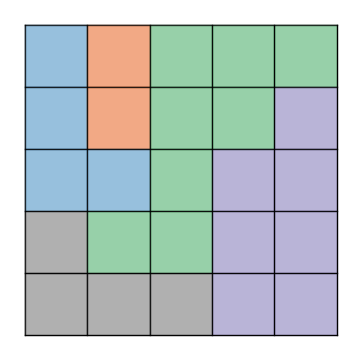

# StarBattle
Star Battle (also known as Two Not Touch) is a logic puzzle involving placement of stars on a grid under specific constraints. This project provides tools to:
- Generate Star Battle puzzles of varying sizes and complexities
- Solve Star Battle puzzles using combinatorial optimization techniques
- Assess difficulty of generated puzzles based on computational metrics
- 
This work forms part of my final-year BSc Computer Science & Artificial Intelligence project, focusing on combinatorial optimization, constraint satisfaction, and computational complexity.

## About Star Battle
A Star Battle puzzle consists of an NxN grid divided into N regions
Rules:
 - Each row, column, and region must contain exactly N stars
 - Stars cannot touch each other, not even diagonally

The challenge lies in efficiently generating puzzles with unique solutions and measuring how “difficult” they are to solve.

